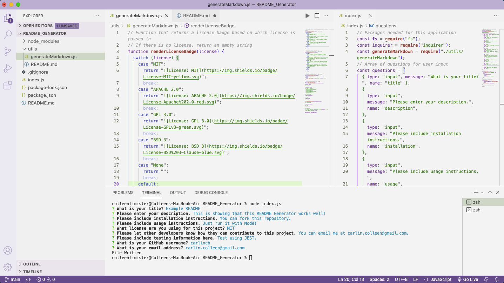

# README_Generator

## Description

### **What was my motivation?**

    I needed to create an application for generating a professional README file.

### **Why did I build this project?**

    I built this project to better understand how to implement Node.js, JavaScript Objects, Switch Statements, and Function Dependency.

### **What problem does it solve?**

    This project creates an application to quickly generate a README with much of the formatting and questions already in place.

### **What did I learn?**

    I learned about Node.js, JavaScript Objects, Switch Statements, and Function Dependency.

## User Story

```md
AS A developer
I WANT a README generator
SO THAT I can quickly create a professional README for a new project
```

## Acceptance Criteria

```md
GIVEN a command-line application that accepts user input
WHEN I am prompted for information about my application repository
THEN a high-quality, professional README.md is generated with the title of my project and sections entitled Description, Table of Contents, Installation, Usage, License, Contributing, Tests, and Questions
WHEN I enter my project title
THEN this is displayed as the title of the README
WHEN I enter a description, installation instructions, usage information, contribution guidelines, and test instructions
THEN this information is added to the sections of the README entitled Description, Installation, Usage, Contributing, and Tests
WHEN I choose a license for my application from a list of options
THEN a badge for that license is added near the top of the README and a notice is added to the section of the README entitled License that explains which license the application is covered under
WHEN I enter my GitHub username
THEN this is added to the section of the README entitled Questions, with a link to my GitHub profile
WHEN I enter my email address
THEN this is added to the section of the README entitled Questions, with instructions on how to reach me with additional questions
WHEN I click on the links in the Table of Contents
THEN I am taken to the corresponding section of the README
```

## Table of Contents

- [Installation](#installation)
- [Usage](#usage)
- [Credits](#credits)
- [License](#license)
- [Contributing](#contributing)
- [Tests](#tests)
- [Questions](#questions)

## Installation

Here are some guidelines to help you get started:

- Installation can completed by forking and cloning this repository onto your desktop.

- Create a `.gitignore` file and include `node_modules/` and `.DS_Store/` so that your `node_modules` directory isn't tracked or uploaded to GitHub. Be sure to create your `.gitignore` file before installing any npm dependencies.

- Make sure that your repo includes a `package.json` with the required dependencies. You can create one by running `npm init` when you first set up the project, before installing any dependencies.

## Usage

This application can be run using the terminal with Node.js.<br/>Please see below for examples of a typical user through my application:

### Screenshot of application:



### Video of Usage:


## Credits

- https://coding-boot-camp.github.io/full-stack/github/professional-readme-guide

## License

[](https://opensource.org/licenses/MIT)<br/>

    MIT License

    Copyright (c) 2021 COLLEEN FIMISTER

    Permission is hereby granted, free of charge, to any person obtaining a copy
    of this software and associated documentation files (the "Software"), to deal
    in the Software without restriction, including without limitation the rights
    to use, copy, modify, merge, publish, distribute, sublicense, and/or sell
    copies of the Software, and to permit persons to whom the Software is
    furnished to do so, subject to the following conditions:

    The above copyright notice and this permission notice shall be included in all
    copies or substantial portions of the Software.

    THE SOFTWARE IS PROVIDED "AS IS", WITHOUT WARRANTY OF ANY KIND, EXPRESS OR
    IMPLIED, INCLUDING BUT NOT LIMITED TO THE WARRANTIES OF MERCHANTABILITY,
    FITNESS FOR A PARTICULAR PURPOSE AND NONINFRINGEMENT. IN NO EVENT SHALL THE
    AUTHORS OR COPYRIGHT HOLDERS BE LIABLE FOR ANY CLAIM, DAMAGES OR OTHER
    LIABILITY, WHETHER IN AN ACTION OF CONTRACT, TORT OR OTHERWISE, ARISING FROM,
    OUT OF OR IN CONNECTION WITH THE SOFTWARE OR THE USE OR OTHER DEALINGS IN THE
    SOFTWARE.

## Contributing

You can contribute to this project by emailing me at: carlin.colleen@gmail.com.

## Tests

Tests can be completed using JEST.

## Questions

If you have questions, please contact me at carlin.colleen@gmail.com or find me at https://github.com/carlincb.
